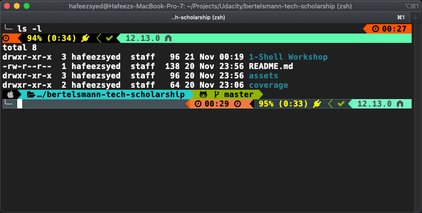

# Shell Workshop

## My shell setup

+ iTerm2
+ oh my zsh
+ [Fancy configuration](https://github.com/Powerlevel9k/powerlevel9k/wiki/Show-Off-Your-Config)



## Directory denoations in *NIX (UNIX/LINUX) OS

+ home directory ` ~ `
+ root directory ` / `
+ current directory ` . `
+ parent directory ` .. `

## Shell Commands

```bash
$ ls
```

```bash
$ ls -l
```

```bash
$ ls -la
```

```bash
$ pwd
```

```bash
$ mkdir "directory_name"
```

```bash
$ mkdir -p "/create/nested/directory"
```

```bash
$ mv "/path/from" "/path/to"
```

```bash
$ mv "file-from.html" "file-to.html"
```

```bash
$ cd "/path/to/the/directory"
```

```bash
$ cd ..
```

```bash
$ cp "/file/from/info.txt" "/file/to/info.txt"
```

```bash
$ cp "/copy/directory/from/" "/copy/directory/to/"
```

```bash
$ rm "file-name.txt"
```

```bash
$ rm "*.pdf"
```

```bash
$ rm -i "file-name.txt"
```

```bash
$ rm -f "file-name.txt"
```

```bash
$ rm -fv "file-name.txt"
```

```bash
$ rm -d "/path/to/directory"
```

```bash
$ rm -r "/path/to/directory"
```

```bash
$ rm -r "/remove/everything/inside/directory/*"
```

```bash
$ rm -rf "/path/to/directory"
```

```bash
$ rmdir "/path/to/directory"
```

```bash
$ cat "file-name.txt"
```

```bash
$ less "file-name.txt"
```

```bash
$ ENVIRONMENT_VARIABLE_NAME=some value
```

```bash
$ echo $ENVIRONMENT_VARIABLE_NAME
```

```bash
$ echo "print some text"
```

```bash
$ curl "https://www.google.com"
```

```bash
$ curl "https://www.google.com"
```

```bash
$ curl -L "https://www.google.com"
```

```bash
$ curl -l "https://www.google.com"
```

```bash
$ curl -o file-name.txt -L "https://www.google.com"
```

```bash
$ curl -I "https://www.google.com"
```

```bash
$ curl -i "https://www.google.com"
```

```bash
$ curl -k "https://www.google.com"
```

```bash
$ curl -H "https://www.google.com"
```


## Shell resources

+ [The Bash Academy](https://www.bash.academy/)
+ [Bash Beginners Guide](http://www.tldp.org/LDP/Bash-Beginners-Guide/html/)
+ [Bash Programming HOWTO](http://tldp.org/HOWTO/Bash-Prog-Intro-HOWTO.html)
